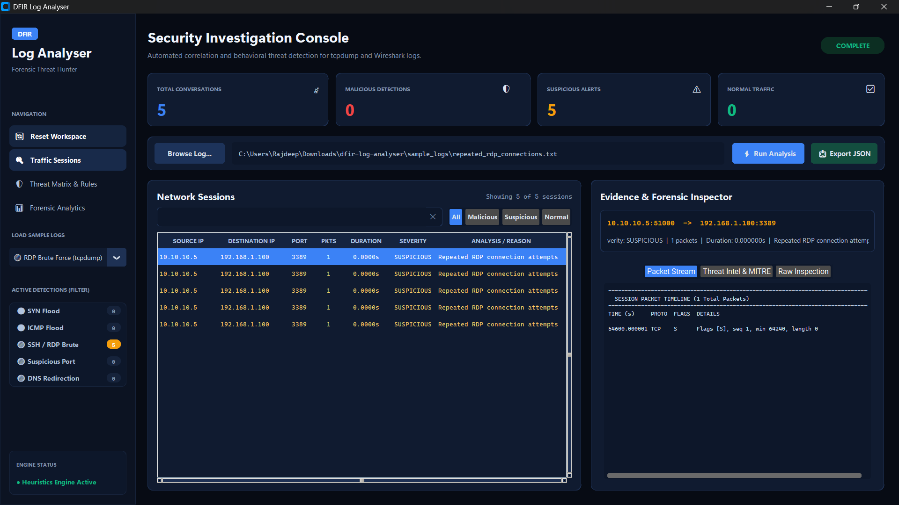

<div align="center">


<br/>


<br/>

> **A Python-based DFIR tool that ingests raw tcpdump log files and Wireshark CSV exports, automatically correlates network events into bidirectional connections, classifies them as Normal / Suspicious / Malicious, and surfaces attack patterns: available as both a CLI tool and a desktop GUI dashboard.**

</div>

---

## Dashboard



---

## Features

| Feature | Description |
|---------|-------------|
| **Event Correlation Engine** | Groups raw packet log entries into bidirectional conversations by IP endpoint pair and port |
| **Wireshark & tcpdump Support** | Ingests both plaintext tcpdump captures and exported Wireshark CSV logs |
| **SYN Flood Detection** | Identifies volumetric TCP SYN half-open connection floods with 0 completed ACKs |
| **ICMP Flood Detection** | Flags high-frequency ping flood denial of service attempts from single source IPs |
| **SSH & RDP Brute Force** | Tracks repeated authentication attempts across ephemeral ports to administration services |
| **Suspicious Backdoor Ports** | Flags connections to known reverse shell and listener ports (4444, 1337, 31337) |
| **Traffic Redirect Detection** | Correlates DNS query resolutions against subsequent HTTP/HTTPS endpoints |
| **Desktop GUI Workstation** | Multi-view CustomTkinter console with live filter badges, MITRE ATT&CK guidance, and telemetry breakdown |
| **Interactive CLI Mode** | Rich-formatted terminal table output and automated summaries |
| **JSON Forensic Reports** | Export structured incident response JSON reports directly to documents folder |

---

## Detection Logic

### 1. SYN Flood
Triggered when a source IP transmits **10+ SYN packets** without completed TCP handshake ACKs. Indicates socket exhaustion denial of service.

### 2. ICMP Flood
Triggered when **10+ ICMP packets** originate rapidly from a single source host.

### 3. SSH & RDP Brute Force
Triggered when **5+ repeated connection attempts** target authentication ports 22 (SSH) or 3389 (RDP).

### 4. Suspicious Ports
Alerts on network connections to well-known post-exploitation listener ports (4444, 1337, 31337).

### 5. Traffic Redirection & DNS Mismatch
Tracks DNS query/response mappings and detects HTTP/HTTPS traffic to destination IPs that deviate from resolved DNS records.

---

## Project Structure

```
dfir-log-analyser/
│
├── analyser.py         # CLI entry point (argparse)
├── gui.py              # GUI entry point (CustomTkinter workstation)
├── parser.py           # tcpdump and Wireshark CSV parser + DNS correlation
├── correlator.py       # Event grouping engine: bidirectional connection keys
├── classifier.py       # Attack detection: SYN flood, ICMP, brute force, backdoor, redirect
├── reporter.py         # Terminal output (Rich) + JSON report export
├── models.py           # Data structures: Event and Connection dataclasses
│
├── sample_logs/        # Bundled test scenarios (tcpdump text & Wireshark CSV)
│   ├── syn_flood_attack.txt
│   ├── icmp_flood_attack.txt
│   ├── repeated_rdp_connections.txt
│   ├── suspicious_port.txt
│   ├── syn_flood.txt
│   ├── wireshark_syn_flood.csv
│   ├── wireshark_icmp_flood.csv
│   └── wireshark_dns_redirect.csv
│
├── tests/              # Automated unit tests
│   ├── test_gui_callbacks.py
│   ├── test_tcpdump_parser.py
│   └── test_wireshark_parser.py
│
├── assets/
│   └── screenshot.png
│
├── requirements.txt
├── .gitignore
└── README.md
```

---

## Getting Started

### Prerequisites
- Python 3.10+

### Installation

```bash
# Clone the repository
git clone https://github.com/raj19-dev/dfir-log-analyser.git
cd dfir-log-analyser

# Install dependencies
pip install -r requirements.txt
```

### Run the GUI

```bash
python gui.py
```

1. Click **Browse Log...** or pick a scenario from **LOAD SAMPLE LOGS**.
2. Click **Run Analysis** to correlate traffic and run heuristic detection.
3. Click any session to inspect packet streams and MITRE ATT&CK guidance.
4. Click **Export JSON** to save the structured forensic report.

### Run the CLI

```bash
python analyser.py sample_logs/syn_flood_attack.txt
```

With JSON export:

```bash
python analyser.py sample_logs/syn_flood_attack.txt --export
```

---

## Running Unit Tests

```bash
python -m unittest discover tests
```

---

## Dependencies

| Library | Purpose |
|---------|---------|
| `customtkinter` | Modern desktop GUI framework |
| `rich` | Terminal output: tables, panels, colour coding |

Install:
```bash
pip install -r requirements.txt
```

---

## Author

**Rajdeep Ganguly**  
B.Tech Cybersecurity Student 

[](https://github.com/raj19-dev)
[](https://rajdeepcyber.wordpress.com)
[](mailto:gangulyrajdeep482@gmail.com)

---

<div align="center">

⭐ **If you found this useful, consider starring the repo!**


</div>
